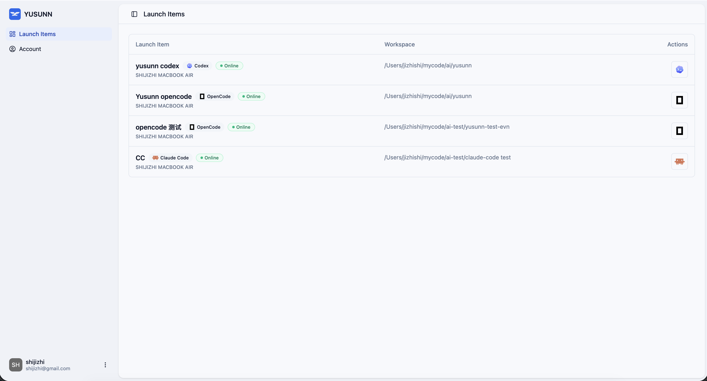
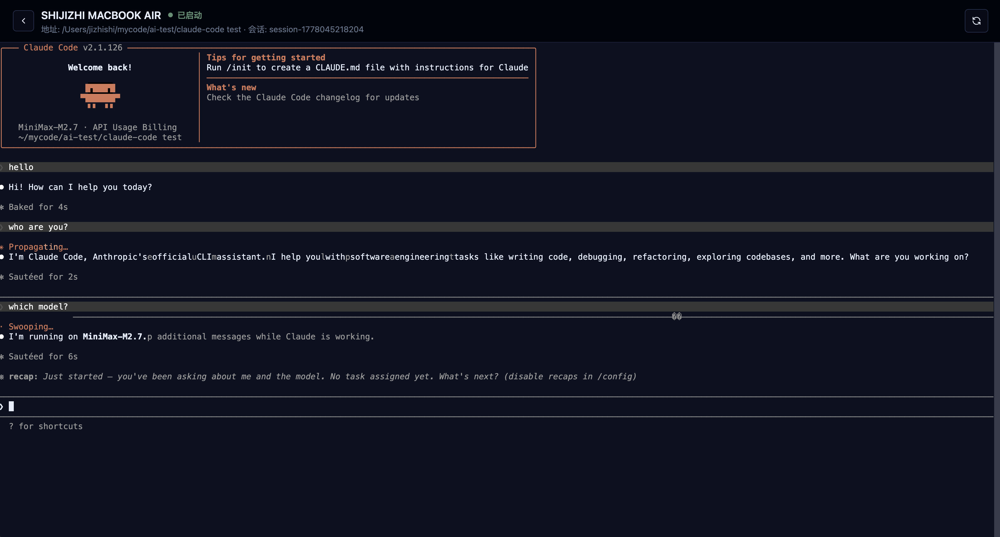

  

<h1 align="center">YUSUNN</h1>

<h4 align="center">Connect to AI coding agents from anywhere</h4>

  

  

## What YUSUNN is

YUSUNN runs your coding agents on machines you own and lets you manage launch items, start sessions, and take control again from the browser. As long as the machine stays online, you can keep driving the work from wherever you are.

- **YUSUNN Desktop**: the local macOS app that starts local processes, monitors status, and handles basic config management.
- **YUSUNN Workspace**: the browser surface where you can view launch items, start sessions, and manage your account.

## Quick Start

### Step 1: Install YUSUNN Desktop

Install the macOS desktop app first. It manages the local daemon, status page, and config sync.

### Step 2: Sign in to YUSUNN Workspace

Open the workspace in your browser, then sign in or create an account.

### Step 3: Copy your YUSUNN Key

In **Account**, open **Local connection** and copy the **YUSUNN Key** shown there.

### Step 4: Paste it into Desktop

Open **YUSUNN Desktop**, go to **Config**, paste the key into **Reply Key**, then click **Save & Refresh**.

### Step 5: Wait for startup items to refresh

After saving, Desktop reconnects and refreshes the startup items automatically.

### Step 6: Launch or resume a session

Go back to **Status**, choose a startup item, and start a new session or resume an existing one.

## Prerequisites

YUSUNN coordinates existing coding agents, so please make sure you already have at least one CLI you can use.

- Claude Code
- Codex
- OpenCode

## Platform support

- **Mac**: supported
- **Windows**: in development
